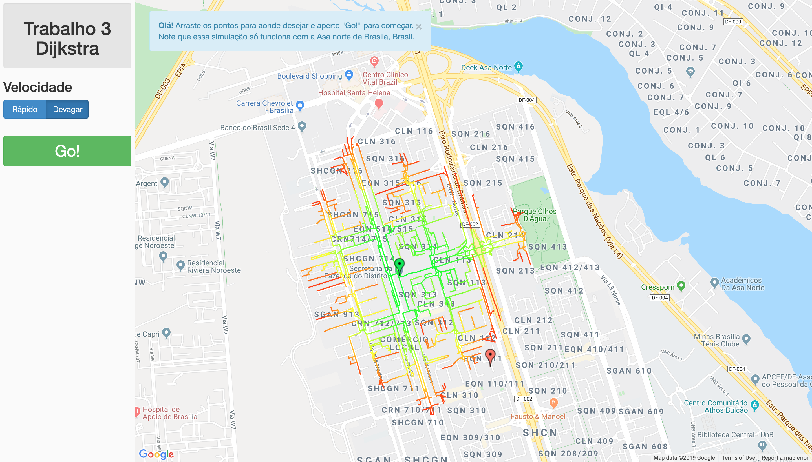

# 🚀 R&T

**Resumo:** Software de geração de Rotas otimizadas.

## 🎯 Objetivo

Neste projeto foi implementado o algoritmo ambicioso dijkstra no google maps, com a posibilidade de poder escolher os lugares de inicio e fim da busca.

## 👨‍💻 Tecnologias Utilizadas

Liste as principais tecnologias, linguagens, frameworks e bibliotecas utilizadas:

- Python 3.12 / Java / C++
- Streamlit / FastAPI / Flask
- SQLite / PostgreSQL
- React / HTML + CSS + JS
- Graphviz / NetworkX (caso use grafos)
- Outros...

- Linguagem: Python, HTML, CSS, JavaScript 
- Framework: FastAPI 
- Bibliotheca: Flask==1.1.1 → Framework web minimalista em Python para desenvolvimento de APIs e aplicações web.
  gunicorn==19.9.0 → Servidor WSGI para aplicações Python, utilizado principalmente para colocar apps Flask em produção.
  Flask-gzip==0.2 → Middleware para compressão Gzip de respostas HTTP no Flask, melhorando desempenho na transmissão de dados.
  Jinja2==2.10.3 → Motor de templates utilizado pelo Flask para renderizar HTML dinâmico.
  Werkzeug==0.16.0 → Toolkit WSGI usado internamente pelo Flask para roteamento, manipulação de requests e responses.
  simplejson==3.16.0 → Biblioteca para manipulação de JSON, similar à nativa json, mas com melhor desempenho e suporte adicional.

## 🗂️ Estrutura do Projeto

R&T/
│
├── src/
│ ├── algorithms/
│ │ ├── astar.py
│ │ ├── bidirectional.py
│ │ ├── ida.py
│ │ └── landmark.py
│ │
│ ├── data/
│ │ ├── brasilia.j
│ │ ├── brasilia_coords.j
│ │ ├── sf.j
│ │ ├── sf_coords.j
│ │ └── map.osm
│ │
│ ├── utils/
│ │ ├── animator.py
│ │ ├── graphutil.py
│ │ ├── OsmGraph.py
│ │ ├── quadtree.py
│ │ └── util.py
│ │
│ ├── routing/ # API e rotas Flask
│ │ └── __init__.py
│ │
│ ├── static/ # Arquivos estáticos
│ │ ├── assets/
│ │ │ ├── fedora.jpg
│ │ │ ├── favicon.ico
│ │ │ └── ...
│ │ ├── gmaps.html
│ │ ├── gmaps.css
│ │ ├── gmaps.js
│ │ └── about.html
│ │
│ ├── pyrouteLib/ # Biblioteca própria
│ │ └── __init__.py
│ │
│ ├── main.py # Arquivo principal Flask
│ ├── main.wsgi # Arquivo WSGI para deploy
│ └── __init__.py
│
├── tests/ # Testes automatizados
│ └── test_algorithms.py
│
├── requirements.txt # Dependências
├── restart.sh # Script para reinicialização
├── Procfile # Arquivo para deploy (Heroku ou afins)
├── .gitattributes # Configurações do Git
└── README.md # Documentação do projeto

## ⚙️ Como Executar


    pip install -r requirements.txt
    python3 main.py

Se ocorrer um erro ao carregar o mapa, crie sua conta na API do Google Maps, crie a Key
e coloque sua chave no arquivo static/gmaps.js

## Gerar Grafos de outros lugares

Nesta simulação, foi mapeado apenas Brasília (Bairro Asa Norte).
Para poder visualizar o algorítmo em outros lugares, é necessrário:

1. Exportar a região desejada do [OpenStreetMap](https://www.openstreetmap.org/)

2. fazer o parse do arquivo com:

```
python routing/OsmGraph.py # python2
```

alterando a rota do .osm no final do arquivo

3. no arquivo main.py mudar:

```
with open("routing/graph_data/brasilia.j") as fp:
    graph = json.loads(fp.read())
with open("routing/graph_data/brasilia_coords.j") as fp:
    graph_coords = json.loads(fp.read())
```

para

```
with open("sua_rota/seu_arquivo.j") as fp:
    graph = json.loads(fp.read())
with open("sua_rota/seu_arquivo_coords.j") as fp:
    graph_coords = json.loads(fp.read())
```


```

### ✅ Rodando Localmente

1. Clone o repositório:

```
git clone https://github.com/olhaopaoital/R-T.git
cd R&T


João Victor Toselli Expedito RGM: 38658364
Willian de Carvalho Oliveira RGM: 34168133
Thiago Henrique dos Santos FreitasRGM: 40564100

## 📸 Demonstrações



## 👥 Equipe

| R&T  | GitHub |
|------|--------|
| João Victor Toselli | [@jao.toselli]([(https://github.com/olhaopaoital)]
| Willian de Carvalho Oliveira RGM: 34168133
| Thiago Henrique dos Santos FreitasRGM: 40564100
---

## 🧠 Disciplinas Envolvidas

- Teoria dos Grafos

## 🏫 Informações Acadêmicas

- Universidade: **Universidade Braz Cubas**
- Curso: **Ciência da Computação / Análise e Desenvolvimento de Sistemas**
- Semestre: 2º / 3º / 4º / 5º / 6º
- Período: Manhã / Noite
- Professora orientadora: **Dra. Andréa Ono Sakai**
- Evento: **Mostra de Tecnologia 1º Semestre de 2025**
- Local: Laboratório 12
- Datas: 05 e 06 de junho de 2025

---

## 📄 Licença

MIT License — sinta-se à vontade para utilizar, estudar e adaptar este projeto.
